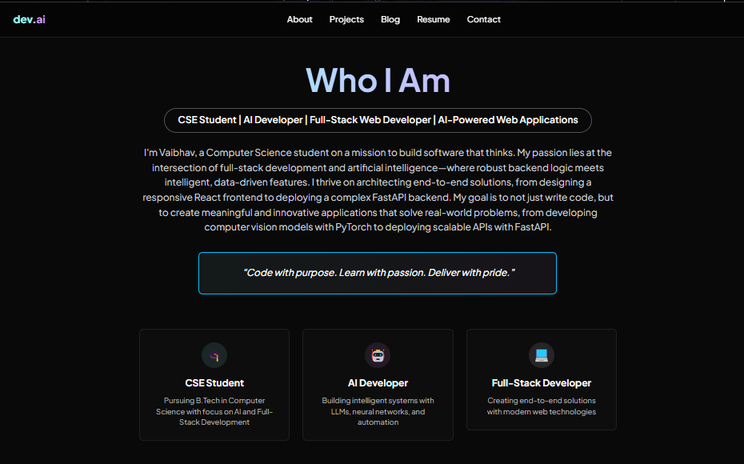

# Vaibhav Waghalkar - AI & Full-Stack Developer Portfolio

[](https://opensource.org/licenses/MIT)

A dynamic and responsive personal portfolio built with React and FastAPI to showcase my projects, skills, and journey in the world of AI-powered web development.

**➡️ Deployed Link Coming Soon**

---

### 📸 Screenshots

Here is a gallery showcasing the website's design and features across different sections.

| Homepage Hero                                   | Projects Section                                  | About Me                                        |
| ----------------------------------------------- | ------------------------------------------------- | ----------------------------------------------- |
|   |  |        |
| **Contact Form** | **Blog Preview** | **Mobile Responsive View** |
|    |      |     |

---

### ✨ Features

-   **Dynamic Content:** Integrated with a Headless CMS for easy updates to projects and blogs without redeploying.
-   **Interactive UI:** Smooth animations and hover effects provide an engaging user experience.
-   **Fully Responsive:** Modern, mobile-first design ensures a perfect look on all devices, from desktops to smartphones.
-   **Contact Form:** A functional contact form powered by EmailJS for easy communication.
-   **Developer Blog:** A dedicated section to share insights and document my technical journey.

---

### 💻 Tech Stack

-   **Frontend:** React, JavaScript, CSS3, HTML5
-   **Backend:** FastAPI, Python
-   **Database/CMS:** Yet to connect
-   **Deployment:** Yet to connect

---

### 🎯 Project Goals

The primary goal of this project was to create a professional, fast, and visually appealing platform to showcase my skills and projects. Key objectives included:

* **Mastering Modern Tools:** Gaining deeper experience with React for the frontend and FastAPI for a high-performance Python backend.
* **Implementing a Headless CMS:** Building a flexible architecture that allows for easy content updates (projects, blog posts) without needing to redeploy the entire application.
* **Focusing on UI/UX:** Designing a clean, intuitive, and fully responsive user interface that provides an excellent user experience on any device.

### 🛤️ Learning Journey

Building this portfolio was a significant learning experience. Some of the key challenges and takeaways include:

* **State Management in React:** Explored different state management strategies to handle UI state and data fetching efficiently.
* **API Integration:** Gained hands-on experience in designing and integrating a RESTful API with a React frontend, paying close attention to asynchronous operations and error handling.
* **Deployment & DevOps:** Researched and planned the deployment process for a full-stack application, including setting up environment variables and preparing for a CI/CD pipeline.

---

### 🚀 Getting Started

To get a local copy up and running, follow these simple steps.

#### Prerequisites

Make sure you have the following installed:
-   Node.js and npm (`npm install -g npm`)
-   Python and pip

#### Installation & Setup

1.  **Clone the repository:**
    ```sh
    git clone [https://github.com/Vaibhav-Waghalkar/Developer-Portfolio.git](https://github.com/Vaibhav-Waghalkar/Developer-Portfolio.git)
    cd Developer-Portfolio
    ```
2.  **Install Frontend Dependencies:**
    ```sh
    cd frontend
    npm install
    ```
3.  **Install Backend Dependencies:**
    ```sh
    cd ../backend
    pip install -r requirements.txt
    ```
4.  **Environment Variables:**
    Create a `.env` file in the backend folder and add any necessary API keys or environment variables.

#### Running the Application

1.  **Run the Backend Server (from the `/backend` directory):**
    ```sh
    uvicorn main:app --reload
    ```
2.  **Run the Frontend Development Server (from the `/frontend` directory):**
    ```sh
    npm start
    ```
Open [http://localhost:3000](http://localhost:3000) to view it in your browser.

---

### 📜 License

This project is distributed under the MIT License. See the `LICENSE` file for more information.